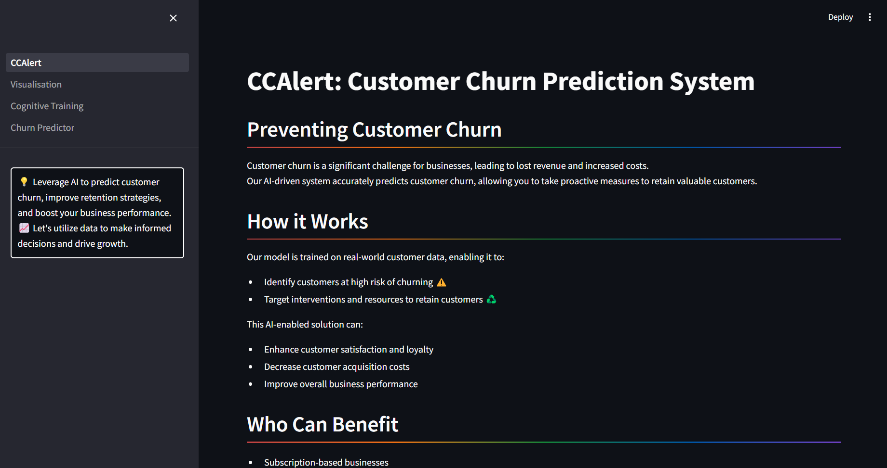

# CCAlert: AI-Powered Customer Churn Predictor

CCAlert is an advanced AI solution designed to predict customer churn, enabling businesses to identify at-risk customers and take proactive measures to retain them. Boost your business performance with actionable insights and data-driven strategies.

## Features

- **AI-Driven Predictions**: Accurately predicts customer churn using advanced machine learning models.
- **User-Friendly Interface**: Simple and intuitive interface for entering customer details and viewing predictions.
- **Interactive Visualizations**: Provides clear and informative visualizations of churn data.
- **Proactive Retention**: Helps businesses identify at-risk customers early and implement retention strategies.

## Screenshots

## Contact Us

To learn more about CCAlert and how it can help your organization, please reach out:

📧 kalpesh2003patel@gmail.com

## License

This project is licensed under the MIT License - see the [LICENSE](LICENSE) file for details.
